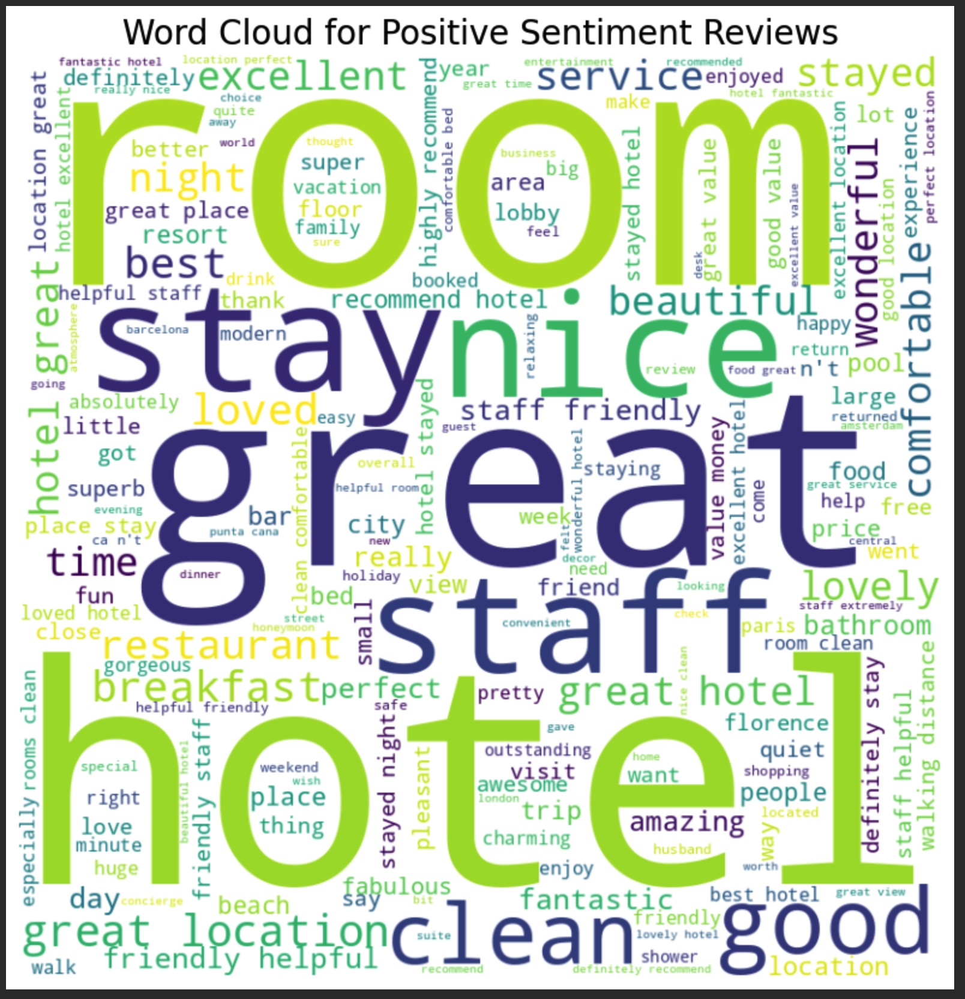
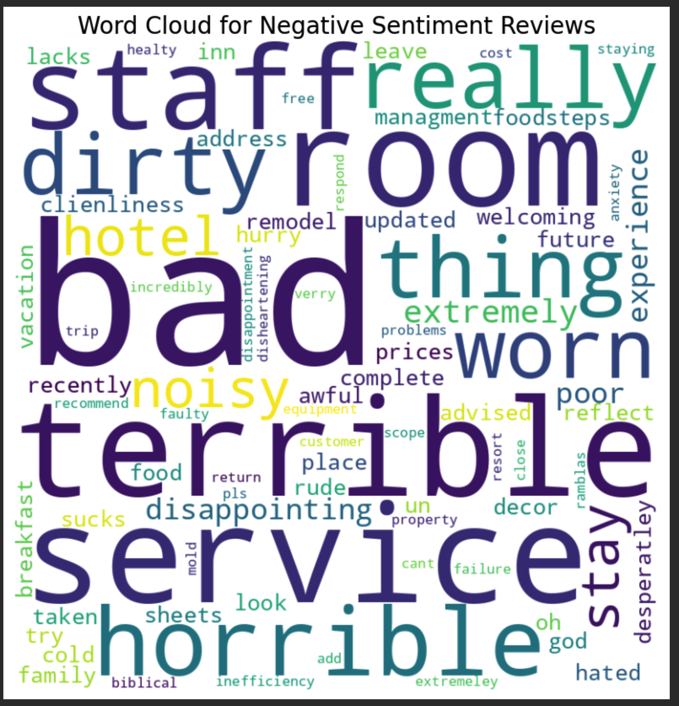

# Sentiment Analysis of Hotel Reviews 💬  

## 📌 Overview  
Ever wondered what guests *really* think about their hotel stays? This project dives into **text mining and sentiment analysis** to extract meaningful insights from hotel reviews. Using **Multinomial Naive Bayes**, we classify reviews as positive or negative and visualize key patterns.

---

## 📦 What's Inside  

### 🔍 Data Exploration  
- Analyzed **20,000+** hotel reviews.  
- Checked for missing values & duplicates.  
- Explored rating distributions and review lengths.  

### 🛠️ Text Preprocessing  
- Cleaned text: **lowercased, removed punctuation, stopwords & special characters**.  
- Applied **TF-IDF** vectorization to convert text into numerical features.  

### 🤖 Model Training  
- Used **Multinomial Naive Bayes (MNB)** for classification.  
- Evaluated with accuracy, precision, recall & F1-score.  
- Addressed class imbalance using **SMOTE oversampling**.  

### 📊 Sentiment Insights  
- Extracted **positive & negative sentiment scores** using VADER.  
- Generated **word clouds** to visualize frequent words in reviews.  

---

## 🖼️ Visual Snapshots  

### ☁️ Word Clouds  
#### ✅ Positive Reviews  

#### ❌ Negative Reviews  

---

## 🚀 Why This Project Rocks  
✔️ **Real-world application** – sentiment analysis is widely used in customer feedback analysis.  
✔️ **Hands-on NLP** – perfect for honing your text mining and machine learning skills.  
✔️ **Business impact** – hotels can use this to improve guest experiences based on real feedback.  

---
